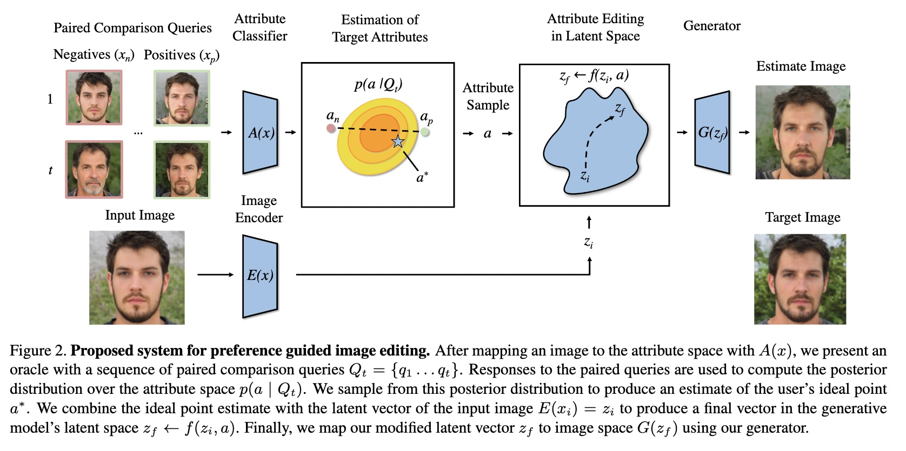
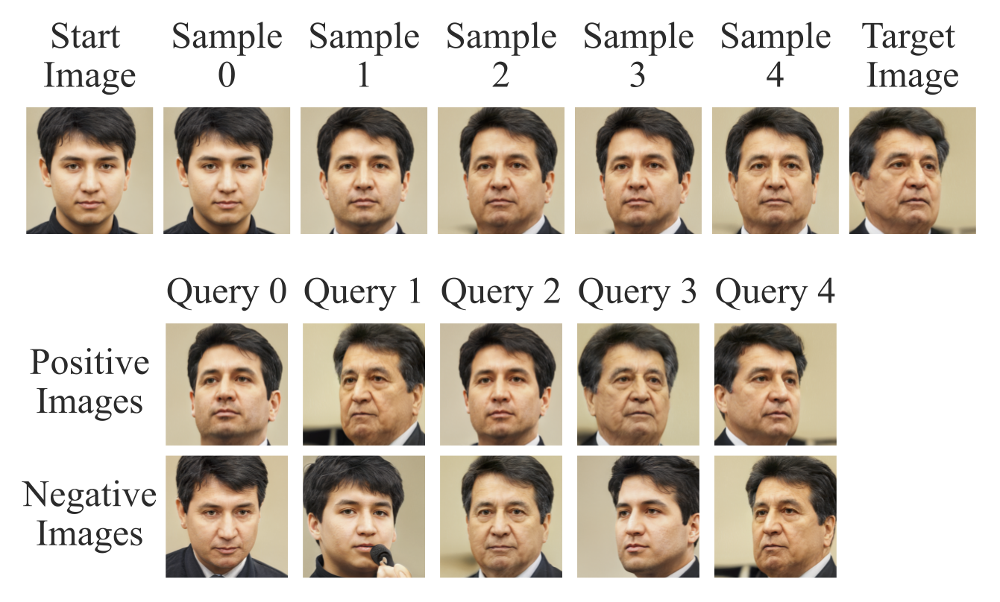

# PrefGen: Preference Guided Image Generation with Relative Attributes
This is the code for the paper "PrefGen: Preference Guided Image Generation with Relative Attributes". 



## Abstract

Deep generative models have the capacity to render high fidelity images of content like human faces. Recently, there has been substantial progress in conditionally generating images with specific quantitative attributes, like the emotion conveyed by one's face. These methods typically require a user to explicitly quantify the desired intensity of a visual attribute. A limitation of this method is that many attributes, like how "angry" a human face looks, are difficult for a user to precisely quantify. However, a user would be able to reliably say which of two faces seems "angrier". Following this premise, we develop the **PrefGen** system, which allows users to control the relative attributes of generated images by presenting them with simple paired comparison queries of the form **"do you prefer image a or image b?"** Using information from a sequence of query responses, we can estimate user preferences over a set of image attributes and perform preference-guided image editing and generation. Furthermore, to make preference localization feasible and efficient, we apply an active query selection strategy. We demonstrate the success of this approach using a StyleGAN2 generator on the task of human face editing. Additionally, we demonstrate how our approach can be combined with CLIP, allowing a user to edit the relative intensity of attributes specified by text prompts. 

## Examples

Here we show a start image, target image, and the result of our method. The start image is the image that we want to edit. The target image is the image that we want to edit the start image to look like. We present an oracle with a set of paired queries and over time update our estimate of the user's current preferences. Eventually, the generated estimates converge on the target image. 
<p align="center">
    
</p>

## Setup
### Create and Activate the Conda Environment
```
    conda env create -f environment.yml
    conda activate prefgen
``` 
### Set environment variable

We need to set the root path of this repository in an environment variable.
```
    export PREFGEN_ROOT=<path to this repository>
```
### Install the package as a local pip package inside of conda
Inside of the PrefGen directory (the directory with setup.py), run the following command:
```
    pip install -e .
```
### Download models

1. Download GAN Control Model files from [here](https://drive.google.com/file/d/19v0lX69fV6zQv2HbbYUVr9gZ8ZKvUzHq/view?usp=sharing) unzip them, and put them in the folder `pretrained/stylegan2_gan_control`. Change the name of the unzipped directory to `controller_dir`.

2. Follow the directions from [here](https://github.com/rosinality/stylegan2-pytorch) to download StyleGAN2 and convert the weights to a pytorch version. Copy the weights into the `pretrained/stylegan2_pt` directory. 

3. Follow the directions from [here](https://github.com/nvlong21/Face_Recognize) to get the Face Identification model. It should have the path `model_ir_se50.pth` and put it in the directory `pretrained/face_identification`.

4. Download the model from [here](https://drive.google.com/file/d/1cUv_reLE6k3604or78EranS7XzuVMWeO/view?usp=sharing) and put it in the directory `pretrained/stylegan2_e4e_inversion`. 

## Citation

```
    Bibtex here
```